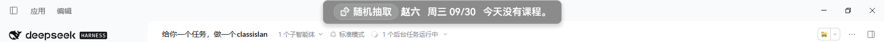

# 随机抽取同学（ClassIsland 插件）

在 ClassIsland 主界面（灵动岛）上放一个 **「随机抽取」按钮组件**：点击后从你在设置里维护的
**备选同学名单** 中随机抽出一位同学，并通过 ClassIsland 提醒（可选语音朗读）公布结果。



## 功能

- 🎲 **主界面按钮组件**：把「随机抽取同学」拖到主界面即可使用，点击按钮抽人。
- 👥 **插件设置页面**：「应用设置 → 随机抽取同学」中维护备选同学名单（一行一个姓名，支持整段粘贴）。
- 📣 **抽取结果提醒**：抽到后弹出 ClassIsland 提醒显示姓名，可选语音朗读，前缀可改，显示时长用滑块调整并在旁边实时显示具体秒数。
- 🚫 **避免连续重复**：可选让下一次抽取排除上一次抽到的人。
- 🎯 **可点击**：用低级鼠标钩子捕捉组件上的点击，不破坏 ClassIsland 的点击穿透。
- 🎨 **组件级设置**：按钮文字、字体大小、自定义颜色、是否显示图标、是否在组件上显示结果。
- 🧹 **干净显示**：没抽过人的时候组件上只有按钮，不会出现「点我抽一位同学」之类的占位提示。

## 安装

把插件目录放进 ClassIsland 的插件目录 `<ClassIsland 数据目录>/Plugins/`，例如：

```
<ClassIsland 数据目录>\Plugins\classisland.random-student-picker\
├─ manifest.yml
├─ ClassIsland.RandomStudentPicker.dll
├─ ClassIsland.RandomStudentPicker.deps.json
├─ icon.png
└─ README.md
```

然后重启 ClassIsland。

## 使用

1. 打开【应用设置 → 随机抽取同学】，填写备选同学名单（一行一个姓名），点「保存名单」。
   列表里带了示例名单，可直接「追加示例名单」看效果；也可以点「试抽一次」验证。
2. 打开【应用设置 → 组件】，把「随机抽取同学」拖到主界面行上。
3. 鼠标移到主界面上的按钮上点击即可抽取（默认使用「全局鼠标钩子」方式）。
4. 想调整按钮外观时，在【组件】页面选中该组件，打开它的组件设置抽屉。

## 关于「主界面点击」

ClassIsland 的主界面窗口在非编辑模式下带有 Win32 扩展样式
`WS_EX_LAYERED | WS_EX_TRANSPARENT | WS_EX_NOACTIVATE`，鼠标消息会被系统**直接派发给下层窗口**；
而且主界面上的组件内容本身也被宿主模板设置为不可命中（组件按设计只用于展示），
所以常规的按钮点击事件永远不会触发。上游已明确不再支持「启用鼠标点击」这一设置
（见 ClassIsland issue #651、#741、#848、#1578）。

本插件因此从系统层面解决：用 `WH_MOUSE_LL` 低级鼠标钩子截获左键按下，判断落点是否在组件的屏幕矩形内，
命中就抽取并**吞掉这一次点击**。

- 只在命中**抽取按钮本身**时生效，其余位置的点击照常穿透到下层窗口，ClassIsland 原有的
  「点一下隐藏主界面」等行为完全不受影响。
- 点击区域按按钮的屏幕投影实时计算（组件原点 + 单位向量求缩放比例 + 按钮局部偏移），
  鼠标落在按钮的任意位置都能触发，不存在「只有某一半能点」的问题；按钮四周另留 3px 容差。
- 不改动主界面窗口的任何样式位，也不会抢焦点。
- 编辑模式下完全交给 ClassIsland 自己处理。
- 设置里可以把这个功能关掉（【主界面点击方式 → 关闭（仅显示）】），此时组件只显示结果，
  抽取请用设置页里的「试抽一次」。

> 旧版本曾提供过「悬停时临时放开点击穿透」模式，已移除：经实测，即使清掉主界面窗口的
> `WS_EX_TRANSPARENT`（甚至同时清掉 `WS_EX_LAYERED` 与 `WS_EX_NOACTIVATE`），鼠标在组件上
> 悬停时按钮也不会出现 `:pointerover` 效果、点击也不会触发，说明组件内容根本收不到指针事件，
> 该模式不可能生效。配置文件里遗留的 `ClickCaptureMode: 2` 会自动回退为钩子模式。

需要 Windows 平台；其他平台上组件只能显示，无法响应鼠标点击。

## 截图

| 主界面上的按钮 | 抽取结果 |
| --- | --- |
|  |  |

## 目录结构

```
ClassIsland.RandomStudentPicker/
├─ Plugin.cs                                  插件入口：加载配置、注册组件/设置页/提醒提供方
├─ manifest.yml                               插件清单
├─ Components/
│  ├─ RandomPickerComponent.axaml(.cs)        主界面「随机抽取」组件
│  └─ RandomPickerComponentSettingsControl.*  组件级设置界面
├─ Views/SettingsPages/
│  └─ PickerSettingsPage.axaml(.cs)           插件设置页面：备选同学名单与抽取选项
├─ Models/
│  ├─ PickerSettings.cs                       插件级设置模型
│  └─ PickComponentSettings.cs                组件级设置模型
├─ Services/
│  ├─ RandomPickerService.cs                  名单读写与抽取逻辑
│  └─ PickerNotificationProvider.cs           抽取结果提醒提供方
├─ Helpers/
│  └─ IslandClickCatcher.cs                   全局鼠标钩子：捕捉组件上的点击并吞掉
└─ docs/                                      截图、布局脚本与备份
```

## 构建与部署

需要 .NET 8 SDK 与 NuGet 网络访问：

```powershell
dotnet build ClassIsland.RandomStudentPicker.csproj -c Release
```

依赖 `ClassIsland.PluginSdk` 2.1.0.1（对应 ClassIsland 2.1.0.1，`apiVersion: 2.0.0.0`）。

构建产物在 `bin/Release/net8.0/`，把其中的 `manifest.yml`、`ClassIsland.RandomStudentPicker.dll`、
`ClassIsland.RandomStudentPicker.deps.json`、`icon.png`、`README.md` 复制到
`<ClassIsland 数据目录>/Plugins/classisland.random-student-picker/` 后重启 ClassIsland 即可。

`docs/AddPickerToLayout.ps1` 可以在不打开界面的情况下，把组件直接写进
`data/Config/ComponentLayouts/Default.json`（`-Remove` 参数可撤销），方便脚本化部署；
它会先把原文件备份为 `.bak`。原始布局备份见 `docs/ComponentLayouts.Default.json.bak`。
